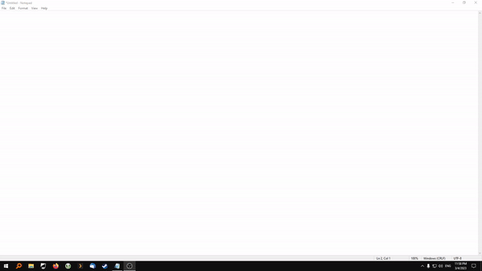

# Hotstring_Hints

Hotstrings can only save you time if you remember to use them. 

This script will tell you if you are typing out an assigned hotkey and will remind you of its trigger.



It is also a fully featured autocompletion menu with customizable appearance, mappings, and behaviour.

For demonstration purposes the repository includes some of GavinPen's excellent [AHKExpansionsList](https://github.com/GavinPen/AHKExpansionsList) and Anders Næss' top ngrams from [Ngramfinder](https://www.ngramfinder.com).

## Mappings

The default mappings are:
* Ctrl+Space: Insert Selection
* Tab:        Next Selection
* Shift+Tab:  Previous Selection
* Ctrl+e:     Hide GUI
* Win+h:      Add Word or Hotstring

The mappings can be changed to any valid AHK hotkey through settings.ini.

## Settings

To change your settings, first copy example_settings.ini to settings.ini.

You will want to direct the settings for hotstring_files, and word_list_files to the paths of your hotstrings and phrase lists. 

For hotstring_files two additional settings must be specified alongside the path:
* load_words: whether to load the hotstrings expansions, and
* load_triggers: whether to load the hotstrings triggers 

This is useful for autocorrections. You may want to be told if you spell a word incorrectly and as such specify load_triggers=1, but you probably do not want to be told how you could spell a word incorrectly and so specify load_words=0.

If the GUI is not displaying correctly you may need to adjust caret_offset, x_window_offset, and y_window_offset.

## Hotstring Parsing

The script has a few limitations when it comes to parsing hotstrings:
* it will only load continuation sections between parentheses (and not actions between braces or, as in V1.1 actions that are returned)
* it does not ignore inline comments
* it does not ignore hotstrings inside multi-line comments

For action based hotstrings it can be useful to append a description of the hotstring to its first line as a comment. 

For example:
```
::curdate:: ;send current date
    SendInput %A_MMMM% %A_DD%, %A_YYYY%
    Return
```

Then, if you forget the trigger you can look it up from the description of the action " ;send current date".

But keep in mind that sending the hotstring through the menu will send the comment and not the action.
